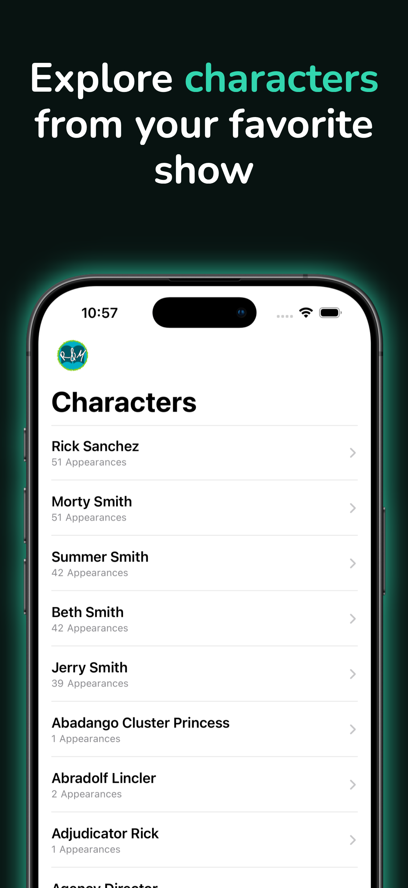
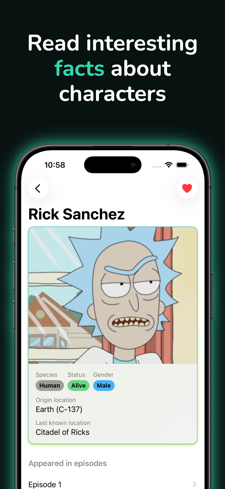
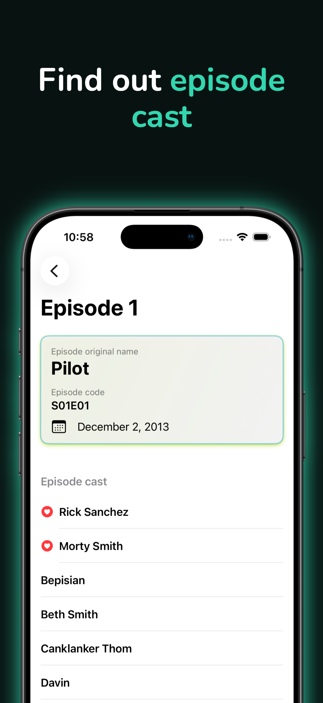
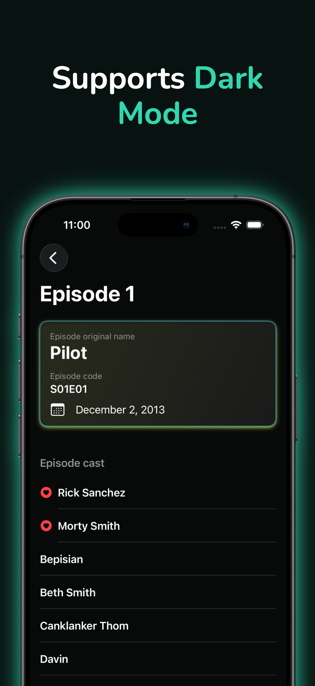

# RickAndMortyWiki

A SwiftUI iOS application built with the public Rick and Morty API.

The goal of this project is to demonstrate a clean and maintainable approach to building an iOS app with SwiftUI, Swift Concurrency, MVVM, dependency injection, localization, previews and unit tests.

## Screenshots

<p align="center">
  
  
  
  
  
</p>

## Features

- Browse Rick and Morty characters
- Search characters by name
- Infinite scroll pagination
- Pull to refresh
- Character details screen
- Episode details screen
- Favorite characters
- Localized UI
- Loading, empty and error states
- SwiftUI previews with mocked data
- Unit tests for ViewModels

## Tech Stack

- Swift 6
- SwiftUI
- Swift Concurrency
- Observation framework
- URLSession
- MVVM
- Light Clean Architecture
- Dependency Injection
- Swift Testing
- String Catalogs localization
- Xcode

## Architecture

The project uses a lightweight MVVM architecture with a clear separation between presentation, domain and data layers.

```text
SwiftUI View
→ ViewModel
→ Repository Protocol
→ Repository Implementation
→ API Client
→ DTO
→ Mapper
→ Domain Model
→ ViewModel
→ View
```

### Main layers

```text
Core
├── Domain
│   ├── Entities
│   └── Repositories
│
├── Data
│   ├── API
│   ├── DTO
│   ├── Mappers
│   └── Repositories
│
├── DI
│   └── AppDependencies
│
└── DesignSystem

Presentation
├── CharactersList
├── CharacterDetails
└── EpisodeDetails

PreviewSupport
├── MockData
└── Repositories
```

## Data Flow

The app keeps the domain layer independent from API and UI details.

API responses are decoded into DTOs, mapped into domain models and then consumed by ViewModels.

Example:

```text
CharacterDTO
→ CharacterDTO+Mapper
→ Character
→ CharactersListViewModel
→ CharactersListView
```

This keeps SwiftUI views focused on rendering UI and keeps networking details outside the presentation layer.

## Dependency Injection

The app uses a simple dependency container:

```swift
struct AppDependencies {
    let characterRepository: any CharacterRepository
    let episodeRepository: any EpisodeRepository
    let favoriteCharactersRepository: any FavoriteCharactersRepository
}
```

Production dependencies use real repositories and a URLSession-based API client.

Preview and test dependencies use mock repositories.

This makes the app easier to preview, test and extend.

## Testing

The project includes unit tests written with Swift Testing.

Current test coverage focuses on ViewModels:

- `CharactersListViewModel`
- `EpisodeDetailsViewModel`
- favorite characters behavior
- loading, empty and error states
- search and pagination logic

## Localization

The app uses `Localizable.xcstrings` for localization.

SwiftUI localized strings are used in views and navigation titles.

## Requirements

- Xcode 16 or newer
- iOS 18.0+
- Swift 6

## Getting Started

1. Clone the repository:

```bash
git clone <repository-url>
```

2. Open the project in Xcode:

```bash
open RickAndMortyWiki.xcodeproj
```

3. Select an iOS simulator.

4. Build and run the app.

## API

This project uses the public Rick and Morty API.

The app fetches:

- characters,
- episodes,
- paginated character lists,
- character details by IDs.

## Project Goals

This project focuses on:

- clean separation of responsibilities,
- readable and testable code,
- modern SwiftUI patterns,
- async/await networking,
- simple dependency injection,
- pragmatic architecture without overengineering.

## Screens

Screens implemented in the app:

- Characters List
- Character Details
- Episode Details

## Notes

This project was created as a learning and portfolio project to practice building a modern SwiftUI application with production-like structure.
